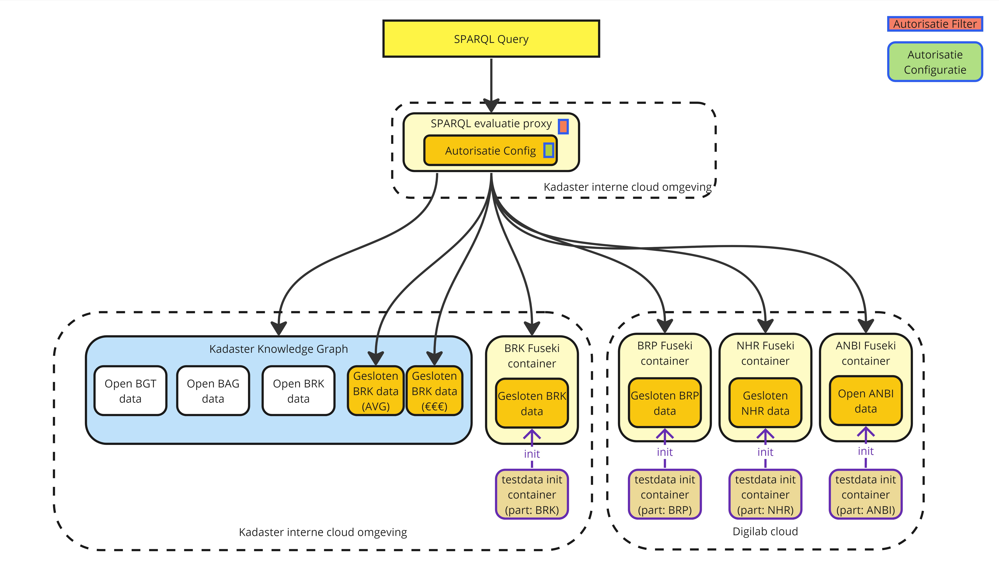

# Lock-Unlock Project - Testdata

> **English**
> 
> This open source project contains the testdata of the [Lock-Unlock
> Project](https://labs.kadaster.nl/cases/lockunlock). In this project we researching and testing to
> '_lock the data and unlock the potential_'; make closed data available to enable research and
> analysis on this data _with_ valid authorization rules in place.

Dit open source project bevat de testdata van het [Lock-Unlock
Project](https://labs.kadaster.nl/cases/lockunlock). In dit project onderzoeken en beproeven wij:
'_lock de data, unlock het pontentieel_'; hoe kunnen we gesloten data beschikbaar maken _met_ behoud
van valide autorisatie regels.

De **testopstelling** is die van de BasisRegistratie Kadaster, BRK. Dat betreft percelen die
gekoppeld zijn aan een geografische locatie (gebied), waar de (zakelijke) rechten uitgegeven zijn
aan mensen of bedrijven, waarbij de bedrijven uiteraard weer te relateren zijn aan mensen en ook
eventueel een ANBI instelling kunnen betreffen.

// TODO informatiemodel plaatje toevoegen

De **testdata** volgt de testopstelling. Het is synthetische (gegenereerde) testdata die gekoppeld
is aan bestaande geografische percelen om deze in een kaartje te kunnen weergeven. Voor het
genereren is gebruik gemaakt van een intern software project, gebaseerd op Java, welke gebruik maakt
van diverse libraries voor het genereren van synthetische data. De uitkomsten hiervan zijn in deze
repo toegevoegd. Vanuit deze repository wordt de testdata (gescript) in de testomgeving geladen.

De **testomgeving** is een verspreide omgeving om een federatieve bevraging te beproeven en ook de
autorisatie op een federatieve wijze te kunnen aantonen. Het Kadaster is verantwoordelijk voor de
bijhouding van de BRK en is daarom een logische partij om de BRK testdata te hosten. Voor de andere
data is dat juist niet logisch en daarom wordt deze in de Digilab omgeving gehost.

## License

Om hergebruik en doorontwikkeling maximaal mogelijk te maken, is dit project gelicenseerd onder
[CC0](LICENSE.md).

> **English**
> 
> To promote reuse and development of this project, this project is licensed under [CC0](LICENSE.md)
